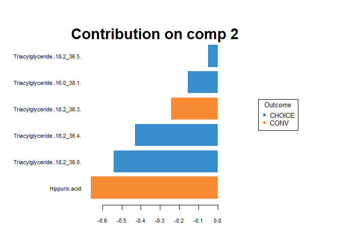
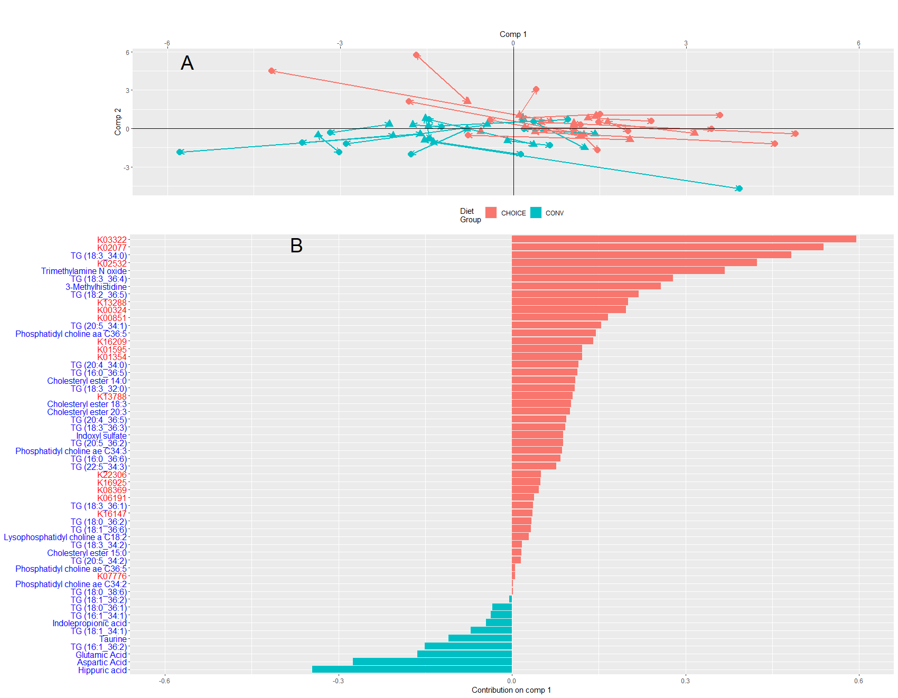

-   [1 Introduction: Fun with GGplots](#introduction-fun-with-ggplots)
    -   [1.1 read in data](#read-in-data)
-   [2 Plot Set 1](#plot-set-1)
    -   [2.1 Plot Set 1: Plot 1](#plot-set-1-plot-1)
    -   [2.2 Plot Set 1: Plot 2](#plot-set-1-plot-2)
    -   [2.3 Plot Set 1: Plot 3](#plot-set-1-plot-3)
    -   [2.4 Plot 1: combine p1, p2, p3](#plot-1-combine-p1-p2-p3)
-   [3 Plot Set 2](#plot-set-2)
    -   [3.1 Plot Set 2: Plot 1](#plot-set-2-plot-1)
    -   [3.2 Plot Set 2: Plot 2](#plot-set-2-plot-2)
    -   [3.3 Plot Set 2: Plot 3](#plot-set-2-plot-3)
    -   [3.4 Plot Set 2: Plot 4](#plot-set-2-plot-4)
    -   [3.5 Plot Set 2: combine p1, p2, p3,
        p4](#plot-set-2-combine-p1-p2-p3-p4)
-   [4 Plot Set 3](#plot-set-3)
    -   [4.1 Plot Set 3: Plot 1](#plot-set-3-plot-1)
    -   [4.2 Plot Set 3: Plot 2](#plot-set-3-plot-2)
    -   [4.3 Plot Set 3: Plot 3](#plot-set-3-plot-3)
    -   [4.4 Plot Set 3: Plot 4](#plot-set-3-plot-4)
-   [5 Plot Set 3: combine p1, p2, p3,
    p4](#plot-set-3-combine-p1-p2-p3-p4)

# 1 Introduction: Fun with GGplots

Honestly, this is just a repository of code that took me forever to get
to work and format. It includes the following: faceting plots,
formatting (scatter, box, bar, alluvial, etc.), adding significance bars
ONTO a facetted plot, and grid.align

``` r
require(mixOmics)
require(tidygraph)
require(ggraph)
require(ggrepel)
require(ggalluvial)
require(RColorBrewer)
require(gridExtra)
require(igraph)
require(reshape2)
require(compositions)
require(factoextra)
require(ggplot2)
require(ggsignif)
require(dplyr)
require(tidyr)
```

``` r
knitr::opts_knit$set(root.dir = "C:/Users/ksugino/Desktop/Github_projects/fun_with_ggplots/")
```

## 1.1 read in data

``` r
# microbiome species 
sp_delta<-read.csv("species_delta.csv")

# KEGG gene annotations
kegg_delta<-read.csv("KEGG_annotation_delta.csv")

# imputed metabolomics
metabo_delta<-read.csv("metabolomics_delta.csv")

# metaboindicator summed values
metabo_ind_delta<-read.csv("metaboindicator_delta.csv")

# diet groups
diet<-read.csv("diet_group.csv")
diet<-factor(diet$x)
```

# 2 Plot Set 1

## 2.1 Plot Set 1: Plot 1

``` r
# DIABLO integration of Microbiota and metabolites
# set up analysis using optimal model parameters (determined through DIABLO tuning of parameters http://mixomics.org/mixdiablo/diablo-tcga-case-study/)
X <- list(Microbiota=sp_delta,
          Metabolomics=metabo_delta)
Y <- diet

# parameters determined by tuning were
# ncomp = 1 ; set to 2 here to get a 2D plot
# keepx Microbiota = c(9,5)
# keepx Metabolomics = c(50,5)
# design = 0.1      #design is decided by the user; closer to 1 prioritizes relationships between data sets, while closer to 0 prioritizes the relationship between data sets and treatment group
# scale = F since the data are already transformed
list.keepX<-list (Microbiota = c(9,5), 
                  Metabolomics = c(50,5))
final.diablo.model = block.splsda(X = X, Y = Y, ncomp = 2, keepX = list.keepX, design = 0.1,scale=F)

# pull model stats
df.microb<-data.frame(final.diablo.model$variates$Microbiota)
df.metabo<-data.frame(final.diablo.model$variates$Metabolomics)

# reform model stats into data frame
df.union<-cbind(df.microb, df.metabo, Y)
colnames(df.union)<-c("micro_c1","micro_c2","metabo_c1","metabo_c2","group")

# plot p1
# plot sPLS-DA of species and metabolomics vs diet group
p1<-ggplot(df.union)+
  
  # since our layout has the coordinates for each data frame in column format, we can plot the points with
  # two geom_point calls (allowing us to change point shape, size, etc.)
  geom_point(aes(x=micro_c1,y=micro_c2, col=group), shape=16, size=4)+
  geom_point(aes(x=metabo_c1,y=metabo_c2, col=group), shape=17, size=4)+
  
  # draw arrows between participant microbiome and metabolome points on the plot, color by diet group
  geom_segment(aes(x = micro_c1, y = micro_c2,xend = metabo_c1, yend = metabo_c2,color=group),
               arrow=arrow(angle=30, length=unit(0.1, "inches") ,ends="both")) +
  
  # I want a transparent background to arrange multiple plots on top of each other
  # I change the margins for each plot to make sure they align well in the grid.arrange
  # remove legend from plot (other plots can take over that duty)
  theme(panel.border=element_blank(),
        plot.background=element_blank(),
        plot.margin=unit(c(0.2,0.2,0,4.5), "cm"),
        plot.tag.position = c(0.18, 0.8),
        plot.tag = element_text(size = 28),
        legend.position="none")+
  
  # relabel the axes, and add plot tag "A" to the top left corner
  # the tag is added on the plot, but by default plots outside of the plot in the margin
  labs(x="Comp 1",y="Comp 2",tag = "A")+
  scale_x_continuous(position = "top",limits = c(-4,4))+
  
  #draw 0,0 lines 
  geom_hline(yintercept=0, col="black")+
  geom_vline(xintercept=0, col="black")
```

## 2.2 Plot Set 1: Plot 2

``` r
# pull sPLS-DA loadings and combine them into a melt data frame
p1_loadings_micro<-plotLoadings(final.diablo.model, block = 1, comp = 1, contrib = 'max', method = 'mean')
```


``` r
p1_loadings_metabo<-plotLoadings(final.diablo.model, block = 2, comp = 1, contrib = 'max', method = 'mean')
```


``` r
p1_loadings_all<-rbind(p1_loadings_micro,p1_loadings_metabo)

# recolor the loading names base on whether they're a microbe or metabolite
a<-ifelse(rownames(p1_loadings_all)%in%rownames(p1_loadings_micro), "red", "blue")

# the metabolite names are kinda messed up, so we'll edit them 
test<-rownames(p1_loadings_all)
rn<-gsub("([0-9]{1})\\.","\\1:",test)   # replace "." between numbers with a ":" and replace the numbers                                            around it with the original values
rn<-gsub("\\.\\."," (",rn)
rn<-gsub("\\."," ",rn)
rn<-gsub("Triacylglyceride","TG",rn)
rn<-gsub("\\:$",")",rn)                 # remove colon at end of string
rn<-gsub("X3:","3-",rn)
rn<-gsub("([a-z]{1})\\_","\\1 ",rn)     # put a space between bacterial names
# rename rows in main data frame
rownames(p1_loadings_all)<-rn

# plot it!
p2<-ggplot(p1_loadings_all, aes(x=importance,
                                y=reorder(rownames(p1_loadings_all),importance),
                                fill=GroupContrib))+
  
  # plot barplot
  geom_bar(stat="identity")+
  
  # label axes and add "B" tag to plot
  labs(title = "", x = "Contribution on comp 1", y = "",tag = "B")+
  
  # adjust axis label location and reorder by loading value
  # adjust margins for grid.arrange
  # ajust tag position and size
  # remove legend
  theme(axis.text.y = element_text(hjust = 1, 
                                   colour = a[order(p1_loadings_all$importance)]),
        plot.margin=unit(c(-0.5,0.2,0.2,-0.2), "cm"),
        plot.tag.position = c(0.47, 0.945),
        plot.tag = element_text(size = 28),
        legend.position="none")+ 

  # set xlim to be symmetrical (I want the 0 to align to the 0 on the sPLS-DA)
  xlim(c(-0.6,0.6))
```

    ## Warning: Vectorized input to `element_text()` is not officially supported.
    ## i Results may be unexpected or may change in future versions of ggplot2.

## 2.3 Plot Set 1: Plot 3

``` r
# set up data from metaboINDICATOR summed values
bioc.temp<-data.frame(diet,metabo_ind_delta)
temp_melt<-melt(bioc.temp)
```

    ## Using diet as id variables

``` r
# re-order the factor levels
temp_melt$variable<-factor(temp_melt$variable,
                           levels=c("TMAO_Synthesis",
                                    "BA_2nd_BA_1st","BA_2nd_Conjugation","BA_2nd_Synthesis",
                                    "Sum_Indoles", "Sum_BCAA","Sum_Aromatic_AA", "Sum_AA",
                                    "Sum_VLCFA_Cer","Sum_LCFA_Cer", "Sum_Cer",
                                    "Sum_SM",
                                    "Sum_CE",
                                    "Sum_LPC",
                                    "Sum_PC_ae", "Sum_PC_aa","Sum_PC",
                                    "Sum_DG",
                                    "Sum_Unsaturated_TG", "Sum_Saturated_TG", "Sum_TG")
                           )

# add metabolite class for the categories above
temp_melt$category<-ifelse(temp_melt$variable%in%c("TMAO_Synthesis"), "Other",
                           ifelse(temp_melt$variable%in%
                                    c("BA_2nd_BA_1st","BA_2nd_Conjugation","BA_2nd_Synthesis"), 
                                  "Bile \nAcids",
                                  
                           ifelse(temp_melt$variable%in%
                                    c("Sum_Indoles", "Sum_BCAA","Sum_Aromatic_AA", "Sum_AA"),
                                  "Amino \nAcids",
                                  
                           ifelse(temp_melt$variable%in%
                                    c("Sum_VLCFA_Cer","Sum_LCFA_Cer", "Sum_Cer",
                                      "Sum_SM",
                                      "Sum_CE",
                                      "Sum_LPC",
                                      "Sum_PC_ae", "Sum_PC_aa","Sum_PC",
                                      "Sum_DG",
                                      "Sum_Unsaturated_TG", "Sum_Saturated_TG", "Sum_TG"), 
                                  "Lipids",
                                  NA
                          ))))

# reorder the factor levels
temp_melt$category<-factor(temp_melt$category,
                           levels = c("Lipids","Amino \nAcids","Bile \nAcids","Other"))


# plot!
p3<-ggplot(temp_melt,aes(x=variable, y=value,fill=diet))+
  
  # make into a boxplot with each data point displayed, colored by diet
  geom_boxplot()+
  geom_point(position=position_dodge(width=0.75), 
             aes(group=diet))+
  
  # change axis labels, add "C" tag
  labs(y="log-fold change", 
       x="",tag = "C")+ 
  
  # remove legend, remove background color (make transparent), adjust plot margins and tag position/size
  theme(legend.position = "none",
        plot.background = element_rect(fill='transparent', color=NA),
        plot.margin=unit(c(1.15,0.2,0,0), "cm"),
        plot.tag.position = c(0.04, 0.98),
        plot.tag = element_text(size = 28))+
  
  # move xaxis to top of plot, draw 0 line
  scale_x_discrete(position = "top")+
  geom_hline(yintercept=0, col="black")+
  
  # flip the plot orientation
  coord_flip()+
  # categorize the metabolites by their class, scales and space are set for formatting
  facet_grid(category~., scales = "free", space = "free")
```

## 2.4 Plot 1: combine p1, p2, p3

``` r
lay <- rbind(c(1,1,1,3,3,3),
             c(2,2,2,3,3,3),
             c(2,2,2,3,3,3))

# plot figure 1
grid.arrange(p1,p2,p3, layout_matrix = lay, heights=c(.8,1,1))
```

    ## Warning: Removed 1 rows containing missing values (`position_stack()`).


# 3 Plot Set 2

## 3.1 Plot Set 2: Plot 1

``` r
# DIABLO integration of microbiota KEGG gene annotations and metabolites
X <- list(Microbial_genes=kegg_delta,
          Metabolomics=metabo_delta)
Y <- diet

# parameters determined by tuning were
# ncomp = 2
# keepx Microbiota = c(16,10)
# keepx Metabolomics = c(40,6)
# design = 0.1      #design is decided by the user; closer to 1 prioritizes relationships between data sets, while closer to 0 prioritizes the relationship between data sets and treatment group
# scale = F since the data are already transformed
list.keepX<-list (Microbial_genes = c(16,10), 
                  Metabolomics = c(40,6))
final.diablo.model = block.splsda(X = X, Y = Y, ncomp = 2, keepX = list.keepX, design = 0.1,scale=F)

group<-diet

# pull model stats
df.microb<-data.frame(final.diablo.model$variates$Microbial_genes)
df.metabo<-data.frame(final.diablo.model$variates$Metabolomics)
# reform model stats into data frame
df.union<-cbind(df.microb, df.metabo, group)
colnames(df.union)<-c("micro_c1","micro_c2","metabo_c1","metabo_c2","group")

# plot p1
# plot sPLS-DA of KEGG genes and metabolomics vs diet group
p1<-ggplot(df.union)+
  
  # since our layout has the coordinates for each data frame in column format, we can plot the points with
  # two geom_point calls (allowing us to change point shape, size, etc.)
  geom_point(aes(x=micro_c1,y=micro_c2, col=group), shape=16, size=4)+
  geom_point(aes(x=metabo_c1,y=metabo_c2, col=group), shape=17, size=4)+
  
  # draw arrows between participant microbiome and metabolome points on the plot, color by diet group
  geom_segment(aes(x = micro_c1, y = micro_c2,xend = metabo_c1, yend = metabo_c2,
                   color=group),arrow=arrow(angle=30, length=unit(0.1, "inches") ,
                                            ends="both"), linewidth=1) +
  
  # I change the margins for each plot to make sure they align well in the grid.arrange
  # remove legend from plot (other plots can take over that duty)
  theme(panel.border=element_blank(),
        plot.background=element_blank(),
        plot.margin=unit(c(1.45,0.2,0.2,5.7), "cm"),
        plot.tag.position = c(0.095, 0.8),
        plot.tag = element_text(size = 28),
        legend.position="none")+
  
  # relabel the axes, and add plot tag "A" to the top left corner
  # the tag is added on the plot, but by default plots outside of the plot in the margin
  labs(x="Comp 1",y="Comp 2",tag = "A")+
  scale_x_continuous(position = "top",limits = c(-6,6))+
  
  #draw 0,0 lines 
  geom_hline(yintercept=0, col="black")+
  geom_vline(xintercept=0, col="black")
```

## 3.2 Plot Set 2: Plot 2

``` r
# pull sPLS-DA loadings for comp 1 and combine them into a melt data frame
p1_loadings_micro<-plotLoadings(final.diablo.model, block = 1, comp = 1, contrib = 'max', method = 'mean')
```


``` r
p1_loadings_metabo<-plotLoadings(final.diablo.model, block = 2, comp = 1, contrib = 'max', method = 'mean')
```


``` r
p1_loadings_all<-rbind(p1_loadings_micro,p1_loadings_metabo)

# recolor the loading names base on whether they're a gene or metabolite
a<-ifelse(rownames(p1_loadings_all)%in%rownames(p1_loadings_micro), "red", "blue")

# the metabolite names are kinda messed up, so we'll edit them 
test<-rownames(p1_loadings_all)
rn<-gsub("([0-9]{1})\\.","\\1:",test)   # replace "." between numbers with a ":" and replace the numbers                                            around it with the original values
rn<-gsub("\\.\\."," (",rn)
rn<-gsub("\\."," ",rn)
rn<-gsub("Triacylglyceride","TG",rn)
rn<-gsub("\\:$",")",rn)                 # remove colon at end of string
rn<-gsub("X3:","3-",rn)
rn<-gsub("([a-z]{1})\\_","\\1 ",rn)     # put a space between bacterial names
# rename rows in main data frame
rownames(p1_loadings_all)<-rn


# plot p2!
p2<-ggplot(p1_loadings_all, aes(x=importance,y=reorder(rownames(p1_loadings_all),importance),fill=GroupContrib))+
  
  # plot barplot
  geom_bar(stat="identity")+
  
  # label axes and add "B" tag to plot
  labs(title = "", x = "Contribution on comp 1", y = "",tag = "B")+
  
  # adjust axis label location and reorder by loading value
  # adjust margins for grid.arrange
  # ajust tag position and size
  # remove legend 
  theme(axis.text.y = element_text(hjust = 1, 
                                   colour = a[order(p1_loadings_all$importance,decreasing = F)], 
                                   size=12),
        plot.margin=unit(c(-0.5,0.2,0.2,-.3), "cm"),
        plot.tag.position = c(0.337, 0.89),
        plot.tag = element_text(size = 28),
        legend.position="top")+ 
  scale_fill_discrete(name=c("Diet \nGroup"),labels=c("CHOICE", "CONV"))+ 
  
  # set xlim to be symmetrical (I want the 0 to align to the 0 on the sPLS-DA)
  xlim(c(-0.6,0.6))
```

    ## Warning: Vectorized input to `element_text()` is not officially supported.
    ## i Results may be unexpected or may change in future versions of ggplot2.

## 3.3 Plot Set 2: Plot 3

``` r
# pull sPLS-DA loadings for comp 2 and combine them into a melt data frame
p1_loadings2_micro<-plotLoadings(final.diablo.model, block = 1, comp = 2, contrib = 'max', method = 'mean')
```


``` r
p1_loadings2_metabo<-plotLoadings(final.diablo.model, block = 2, comp = 2, contrib = 'max', method = 'mean')
```



``` r
p1_loadings2_all<-rbind(p1_loadings2_micro,p1_loadings2_metabo)

# recolor the loading names base on whether they're a gene or metabolite
a<-ifelse(rownames(p1_loadings2_all)%in%rownames(p1_loadings2_micro), "red", "blue")

# the metabolite names are kinda messed up, so we'll edit them 
test<-rownames(p1_loadings2_all)
rn<-gsub("([0-9]{1})\\.","\\1:",test)   # replace "." between numbers with a ":" and replace the numbers                                            around it with the original values
rn<-gsub("\\.\\."," (",rn)
rn<-gsub("\\."," ",rn)
rn<-gsub("Triacylglyceride","TG",rn)
rn<-gsub("\\:$",")",rn)                 # remove colon at end of string
rn<-gsub("X3:","3-",rn)
rn<-gsub("([a-z]{1})\\_","\\1 ",rn)     # put a space between bacterial names
# rename rows in main data frame
rownames(p1_loadings2_all)<-rn


# plot p3!
p3<-ggplot(p1_loadings2_all, aes(x=importance,y=reorder(rownames(p1_loadings2_all),importance),fill=GroupContrib))+
  
  # plot barplot
  geom_bar(stat="identity")+
  
  # label axes and add "C" tag to plot
  labs(title = "", x = "Contribution on comp 2", y = "",tag = "C")+
  
  # adjust axis label location and reorder by loading value
  # adjust margins for grid.arrange
  # ajust tag position and size
  # remove legend
  theme(axis.text.x = element_text(colour = a[order(p1_loadings2_all$importance,decreasing = F)],
                                   angle = 40, vjust = 1, hjust=0, size=12),
        plot.margin=unit(c(-1.26,1.5,0.26,0.16), "cm"),
        plot.tag.position = c(0.02, 0.625),
        plot.tag = element_text(size = 28),
        legend.position="none")+ 
  
  # set xlim and ylim to be symmetrical (I want the 0 to align to the 0 on the sPLS-DA)
  scale_y_discrete(expand = c(0, 0),position = 'right')+
  scale_x_continuous(expand = c(0, 0),position = 'top',limits = c(-0.95,0.95))+
  coord_flip()
```

    ## Warning: Vectorized input to `element_text()` is not officially supported.
    ## i Results may be unexpected or may change in future versions of ggplot2.

## 3.4 Plot Set 2: Plot 4

``` r
# read in over-representation analysis of KEGG genes identified above
ora_diet<-read.csv("ORA_diet_results.csv")
ora_diet$sig<-ifelse(ora_diet$p.adjust<0.05, "sig","non-sig")

# alluvial graph set-up; pull only relevant columns
ora_alluvial<-ora_diet[,c(2,9:11)]

# rename correlation groups and assign colors
ora_alluvial$sig<-factor(ora_alluvial$sig, levels = c("sig","non-sig"))
levels(ora_alluvial$sig)<-c("p<0.05","p>0.05")
sig_cols<-ora_alluvial$sig
levels(sig_cols)<-c("black","grey")

# create pallet of 12 colors for each metabolite class
colourCount = length(unique(ora_alluvial$Description))
getPalette = colorRampPalette(brewer.pal(12, "Paired"))


p4<-ggplot(as.data.frame(ora_alluvial),
           aes(y = Count, axis1=Description, axis2=group)) +
  
  # this sets the ribbon colors, etc.
  geom_alluvium(aes(fill = sig), width = 1/12,color="black") +
  
  # this sets the connector points for the ribbons; colors seem to go from top to bottom, left to right
  geom_stratum(width = 1/12, fill = c(getPalette(colourCount),"#76D5D8","#F1B1AC"), color = "black") +
  
  # set stratum names (xaxis names)
  scale_x_discrete(limits = c("Gene Annotation \nPathway", "Diet Group"), expand = c(.05, .05))+ 
  
  # set legend name
  guides(fill=guide_legend(title="Pathway \nSignificance"))+
  
  # add tag to plot
  labs(tag = "D")+
  
  # adjust margins, tag position/size
  theme(axis.text.x=element_text(size=15),
        plot.margin=unit(c(-0.5,2.5,0,0), "cm"),
        plot.tag.position = c(0.026, 0.895),
        plot.tag = element_text(size = 28))+
  
  # remove title
  ggtitle("")+
  
  # attempting to adjust text labels (since they're pretty big); it sorta works
  ggrepel::geom_text_repel(
    aes(label = ifelse(after_stat(x) == 1, as.character(after_stat(stratum)), "")),
    stat = "stratum", size = 4, direction = "y", nudge_x = -.35, max.overlaps = 50) +
  ggrepel::geom_text_repel(
    aes(label = ifelse(after_stat(x)  == 2, as.character(after_stat(stratum)), "")),
    stat = "stratum", size = 4, direction = "y", nudge_x = .2, max.overlaps = 21)+
  
  # reassign colors for significance
  scale_fill_manual(values = c("#FEC41E","grey"))+
  theme(axis.title.y=element_blank(),
        axis.text.y=element_blank(),
        axis.ticks.y=element_blank(),
        legend.position="top")
```

## 3.5 Plot Set 2: combine p1, p2, p3, p4

``` r
# plot everything together! 
# here I do two layouts to arrange the grid (mostly just testing different ways to assemble them)
lay1 <- rbind(c(1,1,1),
              c(2,2,2),
              c(2,2,2))
grid1<-grid.arrange(p1,p2, layout_matrix = lay1, heights=c(.8,1,1))
```

    ## Warning: Removed 2 rows containing missing values (`geom_point()`).

    ## Warning: Removed 2 rows containing missing values (`geom_segment()`).



``` r
lay2 <- rbind(c(1,1,1),
              c(2,2,2),
              c(2,2,2))
grid2<-grid.arrange(p3,p4, layout_matrix = lay2, heights=c(0.8,1,1))
```


``` r
# now we plot them together
grid.arrange(grid1, grid2, ncol=2)
```


# 4 Plot Set 3

## 4.1 Plot Set 3: Plot 1

``` r
# categorize participants into 2 K-means groupings by the change in metabolomics after diet intervention
# seed set to 111 to maintain consistent output of groupings
set.seed(111)
k2 <- kmeans(metabo_delta, centers = 2, nstart = 25)
kgrp<-as.factor(k2$cluster)

# pull plotting elements of K-clusters
p_temp<-fviz_cluster(k2, data = metabo_delta)
k_coord<-p_temp$data

# plot p1!
p1<-ggplot(k_coord,aes(x= x, y= y, fill=cluster, col=cluster))+
  
  # plot points
  geom_point(size=2)+
  
  # plot boxplot, but don't output any of the plotting elements; this is specifically here for the legend
  geom_boxplot(aes(x=0,y=0,col=cluster),size=0, col="black")+
  
  # assign colors and names to the legend
  # I specify both color and fill because I want to affect both elements (they refer to the same plotting variable, but I wanted to managed how the legend looked, i.e., I wanted boxplots)
  scale_fill_manual(values = c("#0e4e53","#d92a27"), 
                    name="K-means \nGroup", 
                    labels=c("KGL","KTG"),
                    aesthetics = c("color","fill"))+
  
  # adjust legend position
  # adjust plot margins, and tag position/size
  theme(legend.position = "bottom",
        plot.margin=unit(c(0.15,0.2,0,2.85), "cm"),
        plot.tag.position = c(0.09, 0.85),
        plot.tag = element_text(size = 28))+
  
  # change plot labels, add tag "A" to plot
  labs(x="Comp 1",y="Comp 2",tag = "A")+
  
  # move xaxis
  scale_x_continuous(position = "top")+
  
  # add ellipse to group clusters
  # add 0,0 lines to plot
  stat_ellipse()+
  geom_hline(yintercept=0, col="black")+
  geom_vline(xintercept=0, col="black")
```

## 4.2 Plot Set 3: Plot 2

``` r
# MetaboINDICATOR values vs K-cluster
bioc.temp<-data.frame(kgrp,metabo_ind_delta)
temp_melt<-melt(bioc.temp)
```

    ## Using kgrp as id variables

``` r
temp_melt$variable<-factor(temp_melt$variable,
                           levels=c("TMAO_Synthesis",
                                    "BA_2nd_BA_1st","BA_2nd_Conjugation","BA_2nd_Synthesis",
                                    "Sum_Indoles", "Sum_BCAA","Sum_Aromatic_AA", "Sum_AA",
                                    "Sum_VLCFA_Cer","Sum_LCFA_Cer", "Sum_Cer",
                                    "Sum_SM",
                                    "Sum_CE",
                                    "Sum_LPC",
                                    "Sum_PC_ae", "Sum_PC_aa","Sum_PC",
                                    "Sum_DG",
                                    "Sum_Unsaturated_TG", "Sum_Saturated_TG", "Sum_TG"))

# add metabolite class for the categories above
temp_melt$category<-ifelse(temp_melt$variable%in%c("TMAO_Synthesis"), "Other",
                           
                           ifelse(temp_melt$variable%in%
                                    c("BA_2nd_BA_1st","BA_2nd_Conjugation","BA_2nd_Synthesis"), 
                                  "Bile \nAcids",
                                  
                                  ifelse(temp_melt$variable%in%
                                           c("Sum_Indoles", "Sum_BCAA","Sum_Aromatic_AA", "Sum_AA"),
                                         "Amino \nAcids",
                                         
                                         ifelse(temp_melt$variable%in%
                                                  c("Sum_VLCFA_Cer","Sum_LCFA_Cer", "Sum_Cer",
                                                    "Sum_SM",
                                                    "Sum_CE",
                                                    "Sum_LPC",
                                                    "Sum_PC_ae", "Sum_PC_aa","Sum_PC",
                                                    "Sum_DG",
                                                    "Sum_Unsaturated_TG", "Sum_Saturated_TG", "Sum_TG"), 
                                                "Lipids",
                                                
                                                NA # else outcome
                                         ))))
# reorder the factor levels
temp_melt$category<-factor(temp_melt$category,
                           levels = c("Lipids","Amino \nAcids","Bile \nAcids","Other"))

# create annotation df (used for plotting significance bars)
# this is a little janky and could be solve programmatically if needed
# but basically, this adds significance bars between comparisons with a p<0.05 after FDR
# it does this by drawing a line between two points that are manually curated, but could be programatically decided since the space between each comparison is constant, and thus the length of the significance line is constant
annotation_df <- data.frame(
  category = c("Lipids"),
  start = c(12.8, 11.8, 10.8, 4.8),
  end = c(13.2, 12.2, 11.2, 5.2),
  y = c(1.05, 2, 1.05, 0.85),
  label = c("*","*","*","*")
)
# we have to add each row number as it's own group, otherwise the annotation * doesn't plot correctly 
# see: https://github.com/const-ae/ggsignif/issues/63
annotation_df$group <- 1:nrow(annotation_df)

p2<-ggplot(temp_melt,aes(x=variable, y=value, fill=category))+
  
  # add boxplot 
  geom_boxplot(aes(fill=kgrp))+
  
  # add points to boxplot, color by group
  geom_point(position=position_dodge(width=0.75), aes(fill=kgrp))+
  
  # add axis labels and "B" tag to plot
  labs(y="log-fold change", x="", tag="B")+ 
  
  # assign colors and names to the legend
  scale_fill_manual(values = c("#d92a27","#0e4e53"), 
                    name=c("K-means Group"),
                    labels=c("KTG", "KGL"))+

  # adjust legend position
  # adjust plot margins, and tag position/size
  theme(legend.position = "none",
        plot.background = element_rect(fill='transparent', color=NA),
        plot.tag.position = c(0.22, 0.975),
        plot.tag = element_text(size = 28))+
  
  # this is where that annotation_df info is input
  geom_signif(data=annotation_df,
              aes(y_position = y, 
                  xmin = start, 
                  xmax = end,
                  annotations = label,
                  group=group), 
              inherit.aes = F,
              tip_length = 0.01, col="red", size=0.8, manual=T)+
  
  # for some reason, adding ggsignif changes the factoring of the categories back to alphabetical,     so we have to change that back in the chunk
  facet_grid(factor(category, levels = c("Lipids","Amino \nAcids","Bile \nAcids","Other"))~., 
             space="free",scales="free")+
  coord_flip()+
  geom_hline(yintercept=0, col="black")
```

    ## Warning in geom_signif(data = annotation_df, aes(y_position = y, xmin = start,
    ## : Ignoring unknown aesthetics: y_position, xmin, xmax, and annotations

## 4.3 Plot Set 3: Plot 3

``` r
# read in LASSO/ANOVA results
kgrp_taxa<-read.csv("kgrp_taxa.csv")

# pull out just terms significant before FDR (since nothing was significant after FDR)
temp_sig<-data.frame(kgrp,sp_delta[,colnames(sp_delta)%in%kgrp_taxa$compound[kgrp_taxa$pval<0.05]])
sig_melt<-melt(temp_sig)
```

    ## Using kgrp as id variables

``` r
p3<-ggplot(sig_melt,aes(x=variable, y=value, fill=kgrp))+
  geom_boxplot()+
  facet_wrap(~variable, scales = "free")+
  geom_point(position=position_dodge(width=0.75), aes(group=kgrp))+
  theme(axis.title.x=element_blank(),
        axis.text.x=element_blank(),
        axis.ticks.x=element_blank(),
        legend.position = "none",
        plot.margin=unit(c(1.05,1.76,1.45,0.1), "cm"),
        plot.tag.position = c(0.019, 0.95),
        plot.tag = element_text(size = 28))+ 
  scale_fill_manual(values = c("#d92a27","#0e4e53"), name="K-means Group", 
                    labels=c("KGL","KTG"))+
  labs(x="", y="CLR-fold change",tag="C")+ 
  scale_y_continuous(position = "right")+
  geom_hline(yintercept=0, col="black")
```

## 4.4 Plot Set 3: Plot 4

``` r
# read in over-representation analysis of KEGG genes identified by LASSO regression (not done here)
ora_kgrp<-read.csv("ORA_kgrp_results.csv")
ora_kgrp$sig<-ifelse(ora_kgrp$p.adjust<0.05, "sig","non-sig")

# alluvial graph set-up; pull only relevant columns
ora_alluvial<-ora_kgrp[,c(2,9:11)]

# rename correlation groups and assign colors
ora_alluvial$sig<-factor(ora_alluvial$sig, levels = c("sig","non-sig"))
levels(ora_alluvial$sig)<-c("p<0.05","p>0.05")
sig_cols<-ora_alluvial$sig
levels(sig_cols)<-c("black","grey")
ora_alluvial$group<-factor(ora_alluvial$group)
levels(ora_alluvial$group)<-c("KGL","KTG")

# set color pallete for each metabolite class
colourCount = length(unique(ora_alluvial$Description))
getPalette = colorRampPalette(brewer.pal(12, "Paired"))

p4<-ggplot(as.data.frame(ora_alluvial),
           aes(y = Count, axis1=Description, axis2=group)) +
  
  # this sets the ribbon colors, etc.
  geom_alluvium(aes(fill = sig), width = 1/12,color="black") +
  
  # this sets the connector points for the ribbons; colors seem to go from top to bottom, left to right
  geom_stratum(width = 1/12, 
               fill = c(getPalette(colourCount),"#d92a27","#0e4e53"), 
               color = "black") +
  
  # set stratum names (xaxis names)
  scale_x_discrete(limits = c("Gene Annotation \nPathway", "K-means \nGroup"), 
                   expand = c(.05, .05))+ 
  
  # set legend name
  guides(fill=guide_legend(title="Pathway \nSignificance")) +
  
  # add tag to plot
  labs(tag="D")+
  
  # remove title
  ggtitle("")+
  
  # adjust margins, tag position/size
  theme(axis.text.x=element_text(size=10),
        plot.margin=unit(c(-2,2.9,0.2,0), "cm"),
        axis.title.y=element_blank(),
        axis.text.y=element_blank(),
        axis.ticks.y=element_blank(),
        legend.position="top",
        plot.tag.position = c(0.04, 0.9),
        plot.tag = element_text(size = 28))+
  
  # attempting to adjust text labels (since they're pretty big); it sorta works
  ggrepel::geom_text_repel(
    aes(label = ifelse(after_stat(x) == 1, as.character(after_stat(stratum)), "")),
    stat = "stratum", size = 4, direction = "y", nudge_x = -.35, max.overlaps = 50) +
  ggrepel::geom_text_repel(
    aes(label = ifelse(after_stat(x)  == 2, as.character(after_stat(stratum)), "")),
    stat = "stratum", size = 4, direction = "y", nudge_x = .2, max.overlaps = 21)+
  
  # reassign colors for significance
  scale_fill_manual(values = c("#FEC41E","grey"))
```

# 5 Plot Set 3: combine p1, p2, p3, p4

``` r
#plot it all!

lay <- rbind(c(1,1,1,3,3,3),
             c(2,2,2,4,4,4),
             c(2,2,2,4,4,4))
grid.arrange(p1,p2,p3,p4, layout_matrix = lay, heights=c(.8,1,1))
```


